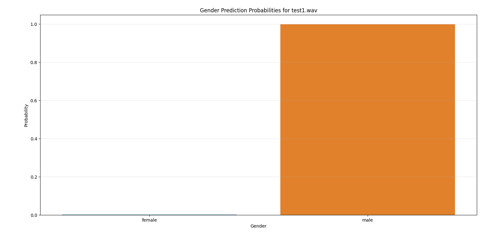

# ỨNG DỤNG XỬ LÝ TÍN HIỆU SỐ VÀO BÀI TOÁN NHẬN DIỆN GIỚI TÍNH QUA GIỌNG NÓI

## Báo cáo bài tập lớn môn Xử lý tín hiệu số

## Cách sử dụng


### 1️. Clone repo:
```bash
git clone https://github.com/phnguyen26/btl-dsp.git
cd btl-dsp
```

### 2. Install Requirements:
```bash
pip install -r requirements.txt
```

### 3. Thêm file audio muốn dự đoán
Example:
```bash
/voice-gender-prediction
│── model.pkl
│── predict.py
│── your_audio.wav  ✅
```
### 4. Paste tên file vào file `predict.py`Example:
```bash
from utils import predict_gender

predict_gender('your_audio.wav')
```

### 5. Run `predict.py`:
```
python predict.py
```
Output example:

